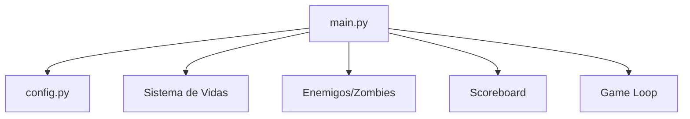

# 🌻 No es Plantas vs Zombies

> **Proyecto Universitario de la UTN**
>


## 👥 Autores

Martin Urriche, Malena Fernandez, Maia Portilla, Florencia Roumieu
---

## 🎯 Objetivo del Proyecto

Desarrollar un juego interactivo donde el jugador controla un girasol que rebota un proyectil (sol) para eliminar zombies organizados en grilla. El proyecto fue creado con fines académicos para demostrar:

- ✅ **Lógica de programación orientada a objetos**
- ✅ **Diseño de interfaces de usuario con formas geométricas**
- ✅ **Manejo de colisiones y detección de formas**
- ✅ **Arquitectura de software modular**

---

## 🛠️ Tecnologías y Habilidades

| Categoría | Tecnologías |
|-----------|-------------|
| **Lenguaje** | Python 3.x |
| **Librería Gráfica** | Pygame |
| **Conceptos** | OOP, Game Loop, Collision Detection, State Management |

---

## 📋 Características Técnicas

### Formas y Geometría
- **Girasol**: Forma circular que controla el jugador
- **Proyectil**: Círculo que rebota contra zombies y bordes
- **Zombies**: Rectángulos con estados de daño progresivo
- **Detección de colisiones**: Algoritmos de intersección de círculos y rectángulos

### Arquitectura del Código


---

## 🎮 Mecánicas del Juego

### Sistema de Formas y Colisiones
- **Colisión circular-rectangular**: Para proyectil vs zombies
- **Colisión circular-circular**: Para proyectil vs bordes
- **Transformación de formas**: Zombies cambian de apariencia según daño recibido

### Estructura de Datos
- **Configuración**: Archivo `config.py` centralizado (6.5KB de lógica de configuración)
- **Estado del juego**: Persistencia en `scoreboard.json`

---

## 📁 Estructura del Repositorio

```
parcial_jueguito/
├── config.py          # Configuración centralizada del juego
├── main.py            # Punto de entrada y game loop
├── README.md          # Documentación del proyecto
└── scoreboard.json    # Datos de puntuación
```

---

## 🎯 Objetivos de Aprendizaje Alcanzados

1. ✅ **Diseño de interfaces con formas geométricas** - Implementación de sprites circulares y rectangulares
2. ✅ **Lógica de colisiones** - Detección y manejo de intersecciones entre formas
3. ✅ **Arquitectura modular** - Separación de configuración, lógica y renderizado
4. ✅ **Gestión de estados** - Menú, juego, pausado, victoria/derrota


---


## 📜 Licencia

Proyecto creado con fines educativos. Uso académico y demostrativo permitido.

---


